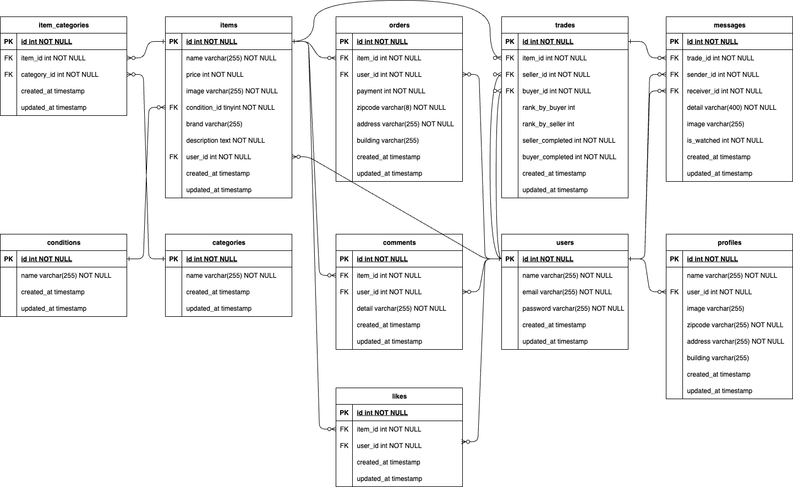

# coachtechフリマ

## プロジェクト概要
- **サービス名**：coachtechフリマ
- **サービス概要**：ある企業が開発した独自のフリマアプリ
- **制作の背景・目的**：アイテムの出品と購入を行うためのフリマアプリを開発する
- **制作の目標**：初年度でのユーザー数1000人達成

## 環境構築

### １.Dockerビルド
1. git clone https://github.com/rikikiri36/mogitest_1
2. docker compose up -d --build

### ２.Laravel環境構築
1. srcに移動してcomposer installを実行
   cd src
   composer install
2. 「.env.example」をコピーして「.env」ファイルを作成
   cp .env.example .env
3. .envに下記環境変数を設定（stripeのAPIキーは発行したものを入力する）
  - DB_HOST=mysql
  - DB_DATABASE=laravel_db
  - DB_USERNAME=laravel_user
  - DB_PASSWORD=laravel_pass
  - STRIPE_KEY=pk_test_XXXXXXX
  - STRIPE_SECRET=sk_test_XXXXXX
4. Laravelの初期設定
   php artisan key:generate
   php artisan migrate:fresh
   php artisan db:seed
5. 商品画像保存用ディレクトリを作成
   mkdir -p storage/app/public/images/items
6. 下記スプレッドシートより商品画像をDLして５で作成したディレクトリに保管
   https://docs.google.com/spreadsheets/d/1AFiW_FhK4WJRihzImjOC8EX3l_x-bAOl7pME1whRZEk/edit?gid=352252877#gid=352252877
　　↑ここから商品画像をDLして６のパスに保存する
7. シンボリックリンク作成
   php artisan storage:link

## 使用技術

- PHP 8.4.1
- Laravel 8.83.29
- MySQL 8.0.41
- Docker 27.5.1
- Stripe 17.1.1
- mailhog 1.0.1

## ER図

## URL

1. 開発環境
   http://localhost/
2. phpMyAdmin
   http://localhost:8080/
3. mailhog
   購入者が取引完了後、出品者にメールが自動配信される
   http://localhost:8025/

## テストアカウント

### 出品したユーザー

| 名前   | メールアドレス                                | パスワード    |
| ---- | --------------------------------------- | -------- |
| てすと太郎 | [testtesttest@example.com](mailto:testtesttest@example.com) | password |
| てすと花子 | [testtesttest2@example.com](mailto:testtesttest2@example.com) | password |

### 何もアクションしていないユーザー

| 名前   | メールアドレス                                | パスワード    |
| ---- | --------------------------------------- | -------- |
| てすと三郎 | [testtesttest3@example.com](mailto:testtesttest3@example.com) | password |